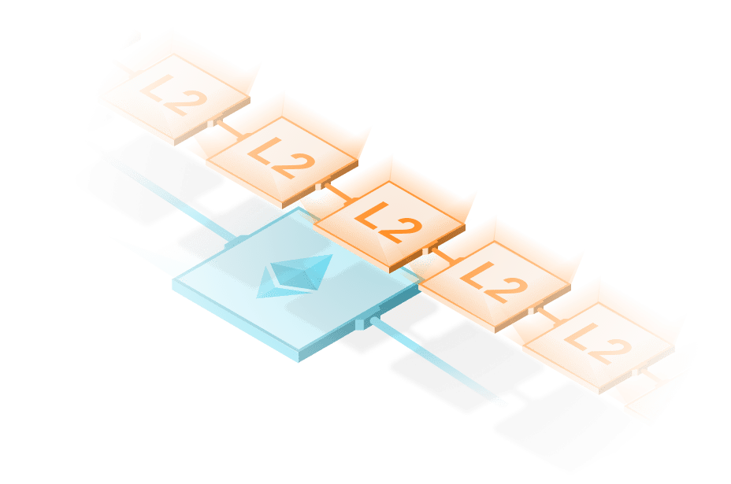

# Layer 2 Scaling Solutions on Ethereum
### 17-09-2022

As the popularity of Ethereum continues to grow, so too does the demand for scalable solutions to the platform's inherent scalability issues. One potential solution to these issues lies in the use of layer 2 scaling solutions, which aim to increase the throughput of the Ethereum network by offloading some of the workload from the main blockchain.

One of the most widely-discussed layer 2 scaling solutions for Ethereum is the implementation of sharding. Sharding is a concept borrowed from database systems, where a large dataset is divided into smaller, more manageable chunks called shards. In the context of Ethereum, sharding would involve dividing the blockchain into multiple shards, each of which would process and store a subset of the data on the blockchain.

This would allow for more transactions to be processed in parallel, increasing the overall throughput of the network. It would also reduce the amount of data that each node needs to process and store, making the network more efficient and scalable.

Another layer 2 scaling solution for Ethereum is the use of state channels, which allow for transactions to be conducted off-chain without the need for them to be recorded on the main blockchain. This can significantly improve the scalability of the network, as transactions can be processed much faster off-chain than on-chain.

One example of a state channel-based scaling solution for Ethereum is the Raiden Network. The Raiden Network uses state channels to enable fast, low-cost, and confidential transactions on the Ethereum blockchain. By offloading transactions to the Raiden Network, users can significantly reduce the burden on the main Ethereum blockchain, improving its scalability and efficiency.

In addition to sharding and state channels, there are also other layer 2 scaling solutions being developed for Ethereum. These include plasma, a framework for building scalable dApps on Ethereum, and the Ethereum Virtual Machine (EVM) parallelization, which aims to increase the number of transactions that can be processed by the Ethereum network by running multiple instances of the EVM in parallel.

Overall, it is clear that layer 2 scaling solutions have the potential to greatly improve the scalability of the Ethereum network. By offloading some of the workload from the main blockchain, these solutions can increase the throughput of the network, reduce transaction times, and lower fees.

However, it should be noted that the implementation of layer 2 scaling solutions for Ethereum is not without its challenges. For example, there are concerns about the security and scalability of sharding, as well as the potential for centralization in state channel-based solutions. These challenges must be addressed in order for layer 2 scaling solutions to be successfully implemented on Ethereum.

Despite these challenges, it is clear that layer 2 scaling solutions offer a promising way forward for the scalability of Ethereum. As the demand for scalable blockchain solutions continues to grow, it is likely that we will see more and more development in this area, bringing us one step closer to achieving the full potential of the Ethereum platform.