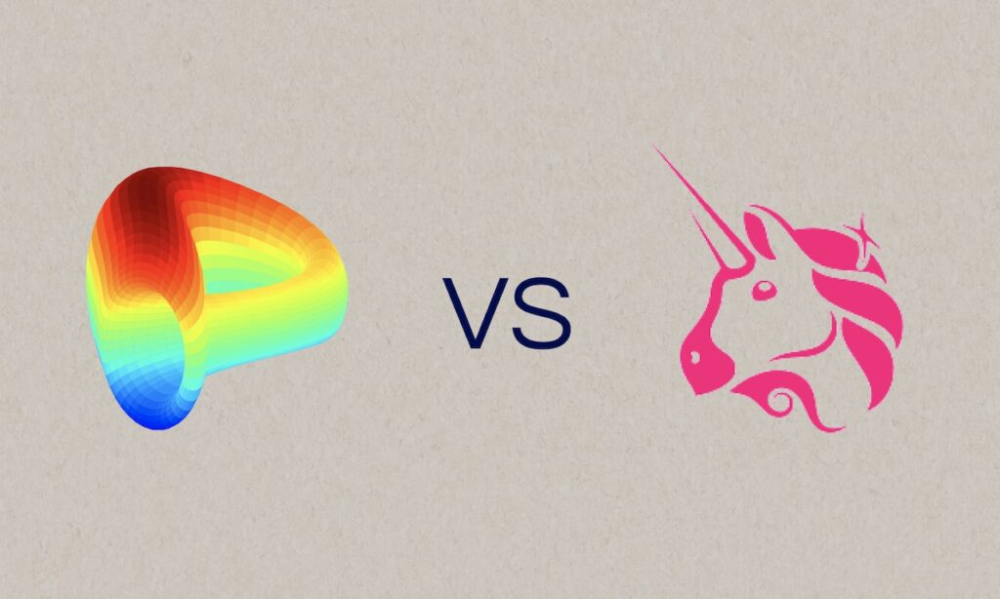

# Automated Market Makers (AMM's)
### 27-10-2022

Automated Market Makers (AMMs) are a new class of decentralized exchange (DEX) that has gained popularity in recent years. AMMs, such as Uniswap and Curve, allow users to buy and sell cryptocurrencies in a decentralized manner, without the need for a central authority or order book.

One of the key advantages of AMMs is their simplicity. Unlike traditional DEXs, which require users to match buy and sell orders manually, AMMs use algorithms to automatically match orders and determine the price of a trade. This makes it easy for users to buy and sell cryptocurrencies, even if they have little experience with trading.

Another advantage of AMMs is their liquidity. Traditional DEXs rely on the liquidity provided by their users, which can be limited if there are not enough users trading on the platform. In contrast, AMMs use a liquidity pool to provide liquidity to their users. This means that there is always a sufficient supply of assets available for trading, even if there are not many users actively trading on the platform.

AMMs also offer improved accessibility compared to traditional DEXs. Many DEXs require users to have a certain level of technical expertise in order to use the platform, such as the ability to interact with smart contracts. In contrast, AMMs are designed to be user-friendly, making it easy for anyone to buy and sell cryptocurrencies on the platform.

Another key advantage of AMMs is their decentralization. Traditional DEXs are often controlled by a central authority, which can create a single point of failure and make the platform vulnerable to censorship. In contrast, AMMs are decentralized, which means that no single entity has control over the platform. This makes AMMs more resilient to attacks and censorship, and allows for greater freedom and autonomy for users.

Uniswap and Curve are two popular Automated Market Makers (AMMs) that have gained significant traction in recent years. While both platforms offer similar functionality, there are some key differences between the two that are worth noting.

One key difference between Uniswap and Curve is the type of assets that they support. Uniswap is a decentralized exchange (DEX) that allows users to trade a wide range of ERC-20 tokens on the Ethereum blockchain. In contrast, Curve is a DEX that focuses on stablecoins, such as DAI and USDC. This makes Curve particularly useful for users who want to trade stablecoins, but may not be as useful for those looking to trade other types of assets.

Another difference between Uniswap and Curve is their liquidity pools. Uniswap uses a single liquidity pool for all of the assets traded on its platform, which means that the liquidity of each individual asset is determined by the liquidity provided by its users. In contrast, Curve uses multiple liquidity pools, each of which is dedicated to a specific asset or group of assets. This allows for more efficient use of liquidity and can result in lower trading fees for users.

A third difference between Uniswap and Curve is their fee structure. Uniswap charges a fixed fee of 0.3% for every trade, which is split between the liquidity providers who contribute to the platform's liquidity pool. In contrast, Curve charges a variable fee that is determined by the amount of liquidity provided by the user. This means that users who provide a larger amount of liquidity to the platform can benefit from lower trading fees.

In terms of advantages, Uniswap has the advantage of being able to support a wider range of assets compared to Curve. This makes it more versatile for users who want to trade a variety of different cryptocurrencies. Additionally, Uniswap's single liquidity pool makes it easy for users to understand how liquidity is provided on the platform, which can be beneficial for those who are new to trading.

On the other hand, Curve has the advantage of being specifically designed for stablecoin trading. This makes it particularly useful for users who are interested in trading stablecoins, as the platform's multiple liquidity pools and variable fee structure can result in lower trading fees and more efficient use of liquidity.

Overall, both Uniswap and Curve have their own unique advantages and disadvantages. Uniswap's support for a wide range of assets and simple fee structure make it well-suited for users who are new to trading, while Curve's focus on stablecoin trading and more efficient use of liquidity make it attractive for users who are more experienced with trading. Ultimately, the choice between the two platforms will depend on the specific needs and preferences of the user.

The advantages of AMMs make them a compelling alternative to traditional DEXs. Their simplicity, liquidity, accessibility, and decentralization make them well-suited for a wide range of users and applications. As the popularity of AMMs continues to grow, it is likely that we will see more and more development in this area, bringing us one step closer to a truly decentralized and accessible financial system.