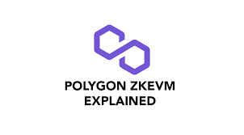

# A Discussion about ZkEVM
### 17-11-2022

ZkEVM is a highly-scalable, efficient, and secure implementation of Ethereum's virtual machine (EVM) that uses zk-SNARKs to enable private, trustless computations on the Ethereum blockchain. This allows for the creation of privacy-preserving smart contracts and decentralized applications (dApps) that can be executed with verifiable correctness and without revealing any sensitive information to the rest of the network.

The EVM is the central component of Ethereum, responsible for executing all smart contracts and dApps on the network. It is a runtime environment that is built into every full Ethereum node and allows developers to write programs in a variety of high-level programming languages, such as Solidity and Vyper, that can be compiled into low-level bytecode and executed on the EVM.

However, the EVM has some limitations when it comes to privacy and scalability. All transactions and computations on the Ethereum network are public and can be viewed by anyone on the network, making it difficult to maintain privacy for certain types of applications. Additionally, the EVM can only process a limited number of transactions per second, limiting the overall scalability of the Ethereum network.

ZkEVM addresses these limitations by leveraging the power of zk-SNARKs, a type of zero-knowledge proof (ZKP) that allows one party (the prover) to prove to another party (the verifier) that a statement is true without revealing any information about the statement itself. This enables private, trustless computations on the Ethereum blockchain, where the input, output, and execution of a smart contract can be verified by the network without revealing any sensitive information.

To use ZkEVM, developers first need to write their smart contract or dApp using a supported programming language and compile it into EVM bytecode. They can then use a zk-SNARK tool, such as Zokrates, to generate a ZKP that can be attached to the transaction and sent to the Ethereum network.

Once the transaction is broadcast to the network, it is processed by the ZkEVM runtime, which executes the bytecode and verifies the ZKP using a trusted setup process. This allows the network to verify the correctness of the computation without needing to see the actual input or output data.

In addition to providing privacy, ZkEVM also improves the scalability of the Ethereum network by enabling the use of off-chain computation. Since the input, output, and execution of a ZkEVM transaction can be verified without revealing the underlying data, the actual computation can be performed off-chain and only the result needs to be sent to the Ethereum network for verification. This reduces the amount of data that needs to be processed on-chain, improving the overall scalability of the network.

Overall, ZkEVM is a powerful tool for enabling private, trustless computations on the Ethereum blockchain. It allows developers to create privacy-preserving smart contracts and dApps that can be executed with verifiable correctness and without revealing any sensitive information, improving the scalability and security of the Ethereum network.